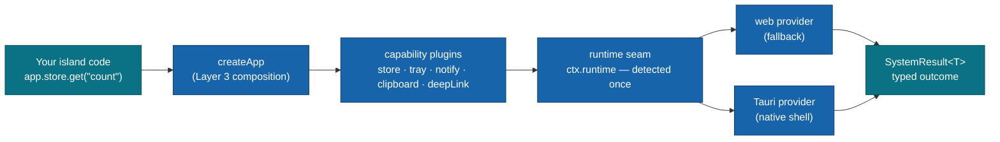

# @moku-labs/system

**One system API, two runtimes — the same island code talks to the OS on native and degrades honestly on the web.**

Isomorphic system capabilities for Moku apps — `store`, `tray`, `notify`, `clipboard`, and `deep-link` — behind an env-style provider seam: a **Tauri provider** when the native shell is detected, a **web provider** otherwise. Your islands never branch on the runtime; a capability that cannot work where it runs says so as typed data (`SystemResult`), never as a thrown surprise. It is not a UI framework and not a Tauri wrapper — it is the seam between your app and whatever shell it happens to be running in.

<br/>

[](https://www.npmjs.com/package/@moku-labs/system)
[](#requirements)
[](https://github.com/moku-labs/core)
[](#requirements)
[](./LICENSE)

<br/>

[Install](#install) · [Quick start](#quick-start) · [Plugins](#plugins) · [The SystemResult contract](#the-systemresult-contract) · [Native permissions](#native-permissions) · [Usage](#usage) · [Development](#development)

---

## Why @moku-labs/system

- **One codebase, web and native.** Every capability selects its provider once at startup (Tauri shell detected → native, otherwise → web). Island code calls the same `app.store.get(...)` everywhere — no second code path to keep in sync.
- **Degraded capability is data, never a throw.** Every method returns `SystemResult<T>` — `{ ok: true, value }` or `{ ok: false, reason }` with a typed reason (`unsupported` / `denied` / `unavailable` / `error`). Tray on the web isn't a crash; it's an answer.
- **Zero-leak bundles.** Plugin instances live at subpath exports (`@moku-labs/system/store`, …); the root exports only `createApp`, `createPlugin`, `ok`, `err`, and types. A store-only consumer carries zero bytes of tray/notify/clipboard/deep-link code.
- **Not a Tauri wrapper.** `@tauri-apps/*` packages are optional peer dependencies, dynamically imported only inside the Tauri providers. Pure-web consumers never install them — and never pay for them.
- **Every exposed method genuinely works, or has a documented typed absence, on both providers.** No method that silently no-ops on one side.

## Install

```sh
bun add @moku-labs/system
```

Building the native shell too? Add the Tauri plugins the capabilities you compose need:

```sh
bun add @tauri-apps/api @tauri-apps/plugin-store @tauri-apps/plugin-notification \
        @tauri-apps/plugin-clipboard-manager @tauri-apps/plugin-deep-link
```

> [!NOTE]
> **Status: `0.x` — early.** All `@tauri-apps/*` packages are **optional** peer dependencies — they are only loaded inside the Tauri providers, via dynamic import, when the native shell is actually detected. Pure-web consumers skip them entirely.

## Quick start

```ts
import { createApp } from "@moku-labs/system";
import { storePlugin } from "@moku-labs/system/store";

const system = createApp({
  plugins: [storePlugin],
  pluginConfigs: { store: { name: "my-app" } }
});

await system.start();

const result = await system.store.get<number>("count");
if (result.ok) {
  console.log(result.value ?? 0, `(from the ${result.provider} provider)`);
} else if (result.reason === "unsupported") {
  // hide the feature — this environment will never support it
} else {
  console.warn(result.reason, result.message);
}

await system.stop();
```

> [!IMPORTANT]
> **Plugin instances are imported from subpaths** — `@moku-labs/system/store`, `/tray`, `/notify`, `/clipboard`, `/deep-link`. The root entry exports `createApp`, `createPlugin`, `ok`, `err`, and *types only*. Why: zero-leak bundles — a root barrel re-exporting instances leaked ~2 KB gzipped of unimported capability code into every consumer (measured); with subpaths, a store-only app carries none of the other capabilities.

## How it works



The `runtime` core plugin (registered automatically, alongside `logPlugin` + `envPlugin` from [@moku-labs/common](https://github.com/moku-labs/common)) detects the shell once — `kind: "tauri"` when the Tauri 2 marker is present on `globalThis`, `"web"` otherwise — and injects `ctx.runtime` (`{ kind, platform }`) on every plugin's context. Each capability plugin resolves its provider from that detection at `app.start()`, fire-and-forget: resolution failures fold into the result of the *next call*, never into a startup throw. Detection happens once, inside the framework. Islands never branch on the runtime.

## The SystemResult contract

Every capability method returns `SystemResult<T>` — a discriminated union you narrow with `result.ok`:

```ts
type SystemOk<T> = { ok: true; value: T; provider: "tauri" | "web" };
type SystemErr = { ok: false; provider: "tauri" | "web"; reason: SystemErrorReason; message?: string };
type SystemResult<T> = SystemOk<T> | SystemErr;
```

| `reason` | Meaning | What to do |
|---|---|---|
| `unsupported` | The capability does not exist here — permanently (tray on web, tray on Tauri iOS/Android, clipboard in an insecure context). | Hide the feature. |
| `denied` | The user or platform *unambiguously* refused permission (notification permission not granted, clipboard `NotAllowedError`). | Explain, or call `requestPermission()` deliberately. |
| `unavailable` | The environment can't deliver *right now* — provider failed to resolve, app not started (`"app not started — call app.start() first"`), app already stopped (`"app stopped"`), Safari private-mode storage probe failed. | Retry later or degrade gracefully. |
| `error` | The provider threw during the operation; the raw message is preserved in `message`. | Log it (`ctx.log` already did) and recover. |

After `app.stop()` a provider whose teardown released a native resource (`store`, `tray`, `deepLink`) answers `unavailable` / `"app stopped"` rather than touching a freed handle — an island that outlives the app gets a typed answer, not a crash. `app.stop()` itself waits at most 5 seconds for a provider still resolving, warns, and completes. A missing optional peer is named: `@tauri-apps/plugin-store is not installed. Add it to the app, or list "store" in @moku-labs/native config.system.`

Environmental failure is data; **programmer errors still throw normally** (e.g. an empty `store.name` fails fast at `createApp` with a `TypeError`). Thrown provider errors are never mapped to `denied` — Tauri ACL throws are ambiguous, so `denied` is reserved for unambiguous returned permission signals.

## Plugins

Compose only what you need — each plugin mounts its API at `app.<name>`:

| Plugin | Import from | Config (`pluginConfigs` key) | Key API | Events |
|---|---|---|---|---|
| [`storePlugin`](./src/plugins/store/README.md) | `@moku-labs/system/store` | `store: { name }` (default `"moku-system"`) | `get` / `set` / `delete` / `keys` / `clear` — JSON-safe key-value persistence (Tauri store file with awaited `save()`; IndexedDB via `idb-keyval` on web) | — |
| [`trayPlugin`](./src/plugins/tray/README.md) | `@moku-labs/system/tray` | `tray: { id, icon? }` (default `"moku-system"`; no `icon` = the app's default window icon) | `setMenu` / `setTooltip` / `setIcon` / `destroy` — desktop tray icon, created lazily on first mutating call | — |
| [`notifyPlugin`](./src/plugins/notify/README.md) | `@moku-labs/system/notify` | — (no config) | `show` / `requestPermission` / `isPermissionGranted` — explicit permission flow; `show()` never auto-prompts | — |
| [`clipboardPlugin`](./src/plugins/clipboard/README.md) | `@moku-labs/system/clipboard` | — (no config) | `readText` / `writeText` — text only; feature-probed, `NotAllowedError` → `"denied"` | — |
| [`deepLinkPlugin`](./src/plugins/deep-link/README.md) | `@moku-labs/system/deep-link` | `deepLink: { schemes }` (default `[]` = all) | `getCurrent` / `onOpen` — launch URL + runtime deliveries; only the one-time launch replay is deduped | `deepLink:open` |
| [`runtime`](./src/plugins/runtime/README.md) *(core — auto-registered)* | — | `runtime: { forceKind, forcePlatform }` (default `null` = auto-detect) | `ctx.runtime.kind` / `ctx.runtime.platform` — the single override point for the whole seam | — |

> [!NOTE]
> `tray` is desktop-only by nature: the web provider and the Tauri mobile (iOS/Android) branch both answer every method with `err("unsupported")` — same contract, no special-casing.

> [!TIP]
> **Deep links on the web.** There is no push channel, and the page's own address is never treated as a deep link. The web provider reads an explicit parameter instead: `?deeplink=` or `#deeplink=`, percent-encoded — `https://app.example/?deeplink=myapp%3A%2F%2Fopen%3Fid%3D1`. Anything else resolves `ok(null)`.

## Native permissions

Every capability that reaches the OS needs a Tauri ACL permission in the app's capability file and a Rust-side plugin. [`@moku-labs/native`](https://github.com/moku-labs/native) codegens exactly this — the capability file, the Cargo dependencies and the plugin registrations — from whichever system plugins your app composes. The table is here so you can audit what a native build will ask for.

| Capability | ACL permissions | Rust side |
|---|---|---|
| `store` | `store:default` | `tauri-plugin-store` — `tauri_plugin_store::Builder::default().build()` |
| `notify` | `notification:default` | `tauri-plugin-notification` — `init()` |
| `clipboard` | `clipboard-manager:allow-read-text`, `clipboard-manager:allow-write-text` | `tauri-plugin-clipboard-manager` — `init()` |
| `deepLink` | `deep-link:default`, `core:event:default` | `tauri-plugin-deep-link` — `init()`, schemes declared in the Tauri config |
| `tray` | `core:tray:default`, `core:menu:default`, `core:image:default`, `core:resources:default` | no plugin crate — Cargo features `tray-icon` + `image-png`. Desktop only |

Two traps the table hides: `clipboard-manager:default` grants nothing, so the two `allow-*` permissions are the ones that matter; the `core:*` entries (tray's four, and `core:event:default`) all ship inside `core:default`. Deep links on Windows and Linux also need single-instance forwarding, which the packager wires.

The two sides name the plugins differently — `@moku-labs/native` keys its `config.system` by the Tauri plugin name:

| This framework | `@moku-labs/native` `config.system` |
|---|---|
| `store` | `store` |
| `notify` | `notification` |
| `clipboard` | `clipboard-manager` |
| `tray` | `tray` |
| `deepLink` | `deep-link` |

## Usage

### Composing multiple capabilities

```ts
import { createApp } from "@moku-labs/system";
import { deepLinkPlugin } from "@moku-labs/system/deep-link";
import { notifyPlugin } from "@moku-labs/system/notify";
import { storePlugin } from "@moku-labs/system/store";

const system = createApp({
  plugins: [storePlugin, notifyPlugin, deepLinkPlugin],
  pluginConfigs: {
    store: { name: "my-app" },
    deepLink: { schemes: ["myapp"] }
    // notify and clipboard take no config — nothing to put here
  }
});

await system.start();

// Explicit permission flow — show() never auto-prompts.
const granted = await system.notify.isPermissionGranted();
if (granted.ok && !granted.value) {
  await system.notify.requestPermission();
}
await system.notify.show({ title: "Done", body: "Export finished." });

// Deep links: launch URL + runtime deliveries.
const launch = await system.deepLink.getCurrent();
const unsubscribe = system.deepLink.onOpen(({ url }) => route(url));
```

### Bundling for the web

Each capability loads its Tauri provider through a lazy `import("./tauri")`, so `@tauri-apps/*` ends up in separate chunks that a web build never executes. Your bundler still has to *resolve* those specifiers. Either install the optional peers (they stay in the unused chunks), or mark them external:

```ts
// Bun
await Bun.build({ entrypoints: ["src/main.ts"], outdir: "dist", external: ["@tauri-apps/*"] });
```

```ts
// Vite / Rollup
export default { build: { rollupOptions: { external: /^@tauri-apps\// } } };
```

### Forcing the runtime (tests, storybooks)

The `runtime` core plugin detects the shell from the environment — `"tauri"` when `globalThis.isTauri === true` or the `__TAURI_INTERNALS__` marker is present, `"web"` otherwise, and the platform from the user-agent. Consumer tests make provider decisions deterministic by stubbing that environment **before** the app starts:

```ts
// Force "tauri" detection: define the shell marker before start() — and pair it with
// mocks of the @tauri-apps/* modules your capabilities load (see each plugin README).
vi.stubGlobal("__TAURI_INTERNALS__", {});

// Force "web" detection: simply run without the marker (the default in vitest/Node).
const app = createApp({
  plugins: [storePlugin],
  pluginConfigs: { store: { name: "test-db" } }
});
```

Detection can also be overridden directly: `pluginConfigs: { runtime: { forceKind, forcePlatform } }` **is** applied — consumer config wins the core-plugin cascade. One catch: `runtime` is a core plugin, so it is not one of `createApp`'s typed `pluginConfigs` keys (those come from the plugins you compose). Hoist the object instead of inlining it, and TypeScript accepts the extra key:

```ts
const pluginConfigs = {
  store: { name: "test-db" },
  runtime: { forceKind: "web", forcePlatform: "windows" }
} as const;

const app = createApp({ plugins: [storePlugin], pluginConfigs });
```

> [!TIP]
> **Extending the framework.** `createPlugin` defines a consumer plugin bound to this framework's types — its `ctx` carries `ctx.runtime`, `ctx.log`, and `ctx.env`:
>
> ```ts
> import { createApp, createPlugin } from "@moku-labs/system";
>
> const myPlugin = createPlugin("my", {
>   api: ctx => ({ ping: () => ctx.runtime.kind })
> });
>
> const app = createApp({ plugins: [myPlugin] });
> ```

## Development

```sh
bun run build              # Build with tsdown (root + 5 subpath entries)
bun run test               # All tests (vitest)
bun run test:unit          # Unit tests only
bun run test:integration   # Integration tests only
bun run test:coverage      # Coverage (90% threshold)
bun run lint               # Biome check + ESLint
bun run lint:fix           # Auto-fix lint issues
bun run format             # Format with Biome
bun run validate           # publint + arethetypeswrong
```

Built test-first. Plugin tests are colocated (`src/plugins/<name>/__tests__/unit/` and `__tests__/integration/`); root `tests/` holds framework-level integration only. Providers are exercised through test doubles — the web store provider runs against `fake-indexeddb`.

## Requirements

- **Node `>= 24`** and **Bun `>= 1.3.14`** — use `bun` exclusively (never npm/yarn/pnpm).
- **TypeScript** in strict mode, with `exactOptionalPropertyTypes` and `noUncheckedIndexedAccess`.
- **[`@moku-labs/core`](https://github.com/moku-labs/core)** — the micro-kernel this framework is built on (bundled dependency).
- **`@tauri-apps/*`** — optional peers, only in the native shell (see [Install](#install)).

## Docs

- Per-plugin READMEs: [store](./src/plugins/store/README.md) · [tray](./src/plugins/tray/README.md) · [notify](./src/plugins/notify/README.md) · [clipboard](./src/plugins/clipboard/README.md) · [deep-link](./src/plugins/deep-link/README.md) · [runtime](./src/plugins/runtime/README.md)
- [Moku Core specification](https://github.com/moku-labs/core/tree/main/specification) — the three-layer model, factory chain, lifecycle, events.
- [`llms.txt`](./llms.txt) / [`llms-full.txt`](./llms-full.txt) — LLM-oriented API reference.

## License

[MIT](./LICENSE) © [moku-labs](https://github.com/moku-labs)
